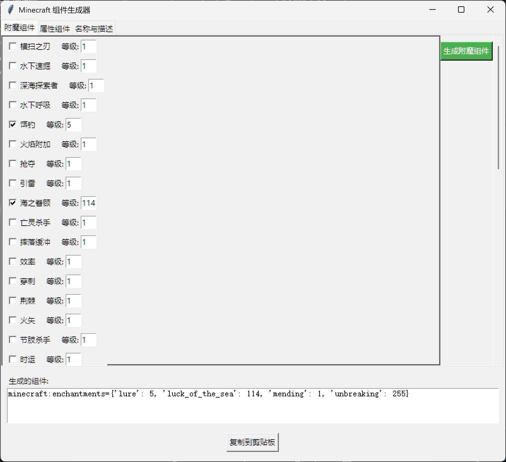

# Minecraft 1.21.7 组件生成器

一个基于 Python 和 Tkinter 的图形界面工具，用于生成 Minecraft 1.21.5 以上版本的物品组件指令。

## 功能特性

- **附魔组件生成**：支持所有主流附魔，可自定义等级
- **属性组件生成**：包含40+种属性修改器，可配置槽位和操作类型
- **名称与描述**：自定义物品名称、显示名称和Lore描述
- **颜色代码支持**：内置§格式颜色代码选择器
- **简洁输出**：直接生成组件部分，方便拼接到/give指令

## 使用说明

### 系统要求
- Python 3.6+

### 安装与运行
直接下载本仓库的zip包，运行__init__.py即可
